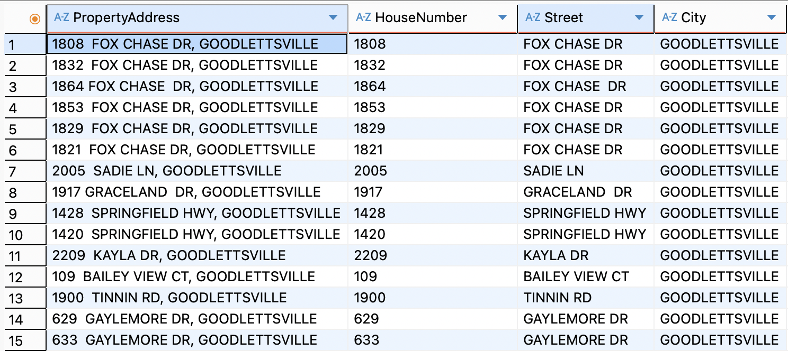
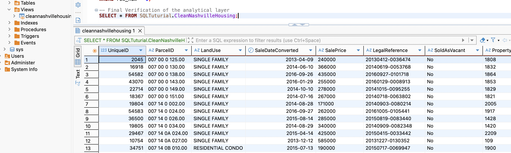

# SQL Data Cleaning Project – Nashville Housing Dataset

## Project Overview

This project focuses on transforming raw, unformatted housing market data from Nashville into a clean, structured, and production-ready dataset for analysis.

While the core project is inspired by popular portfolio tutorials, **I independently migrated and adapted the entire pipeline from SQL Server to MySQL**. This required engineering custom string-parsing algorithms and implementing advanced database architecture principles (such as dynamic VIEWs) to protect data integrity.

---

## Credits & Adaptations (Why this repository is different)

This project is based on the popular **"Data Cleaning in SQL"** tutorial by **Alex The Analyst** (Alex Freberg). However, instead of just rewriting the course code, I used the tutorial as a structural blueprint and significantly upgraded the implementation:

- **Platform Migration (SQL Server --> MySQL):** The original tutorial is written for Microsoft SQL Server. I independently migrated the entire pipeline to MySQL. This required replacing dialect-specific functions (like `PARSENAME`) with custom-engineered, nested string functions (`SUBSTRING_INDEX`, `LOCATE`).
- **The Extra Mile (Granular Parsing):** While the tutorial only splits addresses into two parts, I pushed further and cleanly extracted the **House Number** into its own dedicated column—a critical step for real-world spatial analysis and geocoding.
- **Production-Ready Architecture (VIEW over DELETE):** In the final section, the tutorial uses standard `DELETE` and `DROP COLUMN` commands. Recognizing that hard-deleting records violates data integrity rules in a production environment, I refactored the final pipeline to deploy a dynamic analytical **VIEW**. This secures the raw data while delivering a perfectly cleaned, real-time data stream.

---

## Tech Stack & Skills Demonstrated

- **Database Dialect:** MySQL
- **SQL Concepts:** Common Table Expressions (CTEs), Window Functions (`ROW_NUMBER()`), Self-Joins, Conditional Logic (`CASE` statements), String Manipulation (`SUBSTRING_INDEX`, `LOCATE`, `TRIM`), Data Definition Language (DDL) & Data Manipulation Language (DML).
- **Best Practices:** Data Integrity preservation, Database Architecture (Analytical Layer via VIEWs).

---

## Key Cleaning Steps & Solutions

### 1. Date Standardization

- **Problem:** The original `SaleDate` was stored in an unformatted text format (e.g., "April 9, 2016").
- **Solution:** Used `STR_TO_DATE()` with specific format identifiers to convert the strings into proper ISO `DATE` formats (YYYY-MM-DD) and stored them in a new column to preserve the original raw timeline.

### 2. Populate Missing Address Data

- **Problem:** Several property records had missing (`NULL`) `PropertyAddress` entries, even though their unique `ParcelID` matched other populated records.
- **Solution:** Implemented a **Self-Join** comparing records with identical `ParcelID` but different `UniqueID` to dynamically populate the missing addresses using `IFNULL()`.

### 3. Advanced String Splitting (The Extra Mile)

- **Problem:** Property and Owner addresses were trapped in single, comma-separated text strings, making geographic profiling impossible.
- **Solution:** Since MySQL lacks the `PARSENAME` function found in SQL Server, I engineered a robust workaround using nested `SUBSTRING_INDEX` and `LOCATE` functions.
- **The Extra Mile:** I went beyond the tutorial scope by successfully extracting the **House Number** into its own dedicated column, enabling precise spatial and geocoding analytics.

### 4. Categorical Data Harmonies

- **Problem:** The `SoldAsVacant` column contained mixed entries (`Y`, `N`, `Yes`, `No`).
- **Solution:** Standardized the field into uniform `Yes` / `No` values using a `CASE` statement, making it instantly ready for BI tools like Tableau or Power BI.

### 5. Professional Duplicate Handling (Data Governance)

- **Problem:** The dataset contained duplicate entries for identical sales transactions.
- **Solution:** Used a Window Function (`ROW_NUMBER()`) partition over key attributes (`ParcelID`, `PropertyAddress`, `SalePrice`, `SaleDate`, `LegalReference`) inside a **CTE** to isolate duplicates.
- **Architectural Decision:** Instead of permanently hard-deleting data using `DELETE` (which violates professional enterprise data lineage rules), I created a dynamic analytical **VIEW** called `CleanNashvilleHousing`. This excludeds duplicates and redundant columns in real-time, providing an optimized data stream for analysts while keeping raw data safely intact.

---

## How to Use This Repository

1. **`Nashville_Housing_Cleaning.sql`**: Contains the fully commented, step-by-step MySQL script.
2. Run the script sequentially in your MySQL environment (e.g., dBeaver, MySQL Workbench) to build the cleaning pipeline and deploy the final analytical view.

---

## Key Takeaway

This project demonstrates more than just writing queries; it showcases an **analytical mindset**. By choosing to build a dynamic VIEW instead of altering raw production tables, I applied real-world data governance principles that balance clean output with institutional data security.
